# N7 Zeds Custom Skins Pack

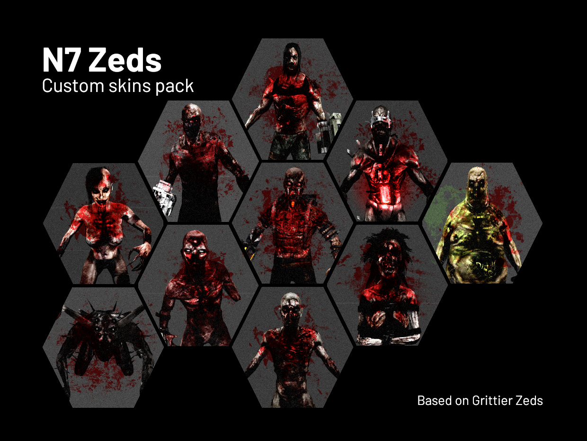

### Description
Majorly reworked, custom version of the known Grittier Zeds texture pack. Used in [N7 Zeds](https://steamcommunity.com/sharedfiles/filedetails/?id=2916067680) mutator.

Some of the original pack's skins (Gorefast, Bloat, Siren) have been added a few details from the Killing Floor Mod textures giving the zeds a more threatening and mutilated yet still quite natural look. 

Some skins have been muchly reconsidered either due to poor appearance decisions in the original pack or out of personal preference (Clot, Crawler, Stalker, Scrake, Fleshpound).

A few zeds have been left unchanged (Husk, Patriarch).

### Installation

Move following files to `Killing Floor/Textures` directory.

```
Textures/KF_Specimens_Trip_T.utx
Textures/KF_Specimens_Trip_T_Two.utx
```

Before replacing it's highly recommended to make a backup of the original textures.

### Appearance

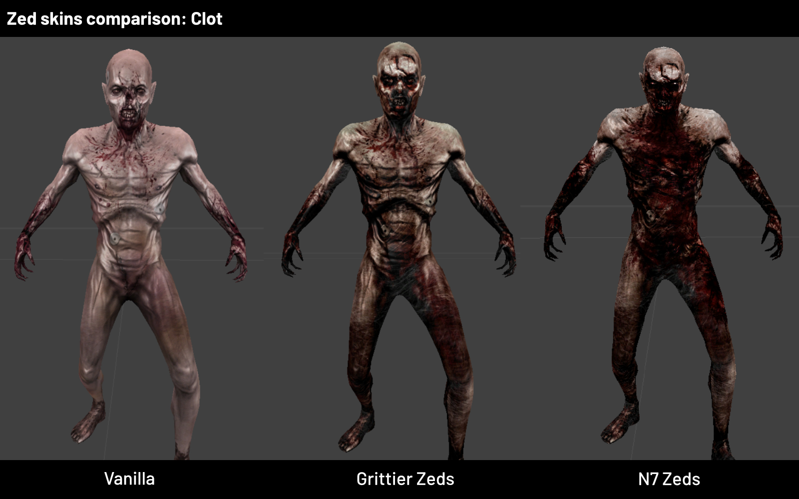
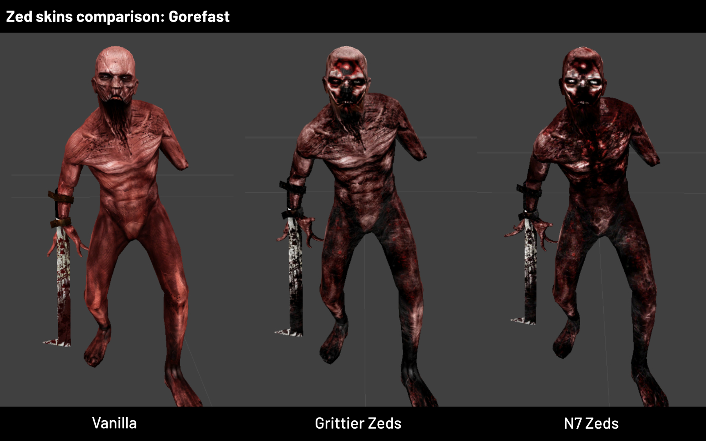
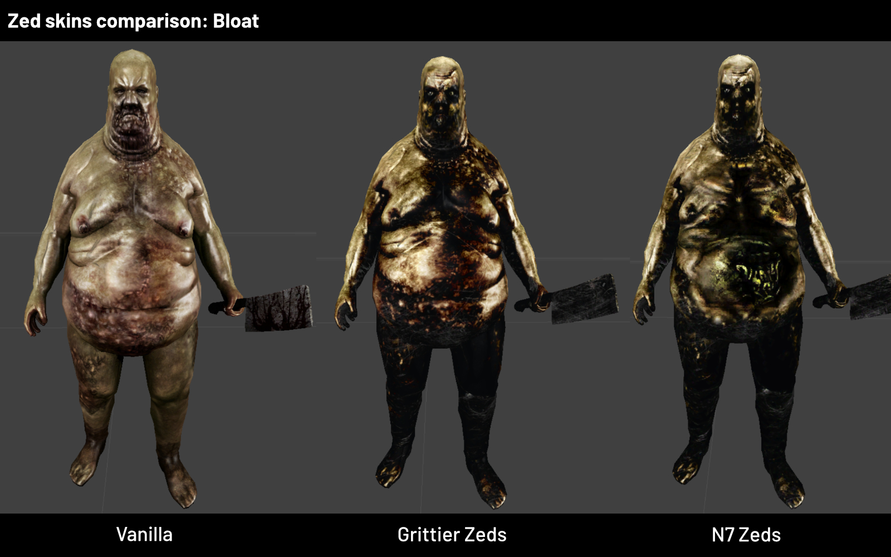
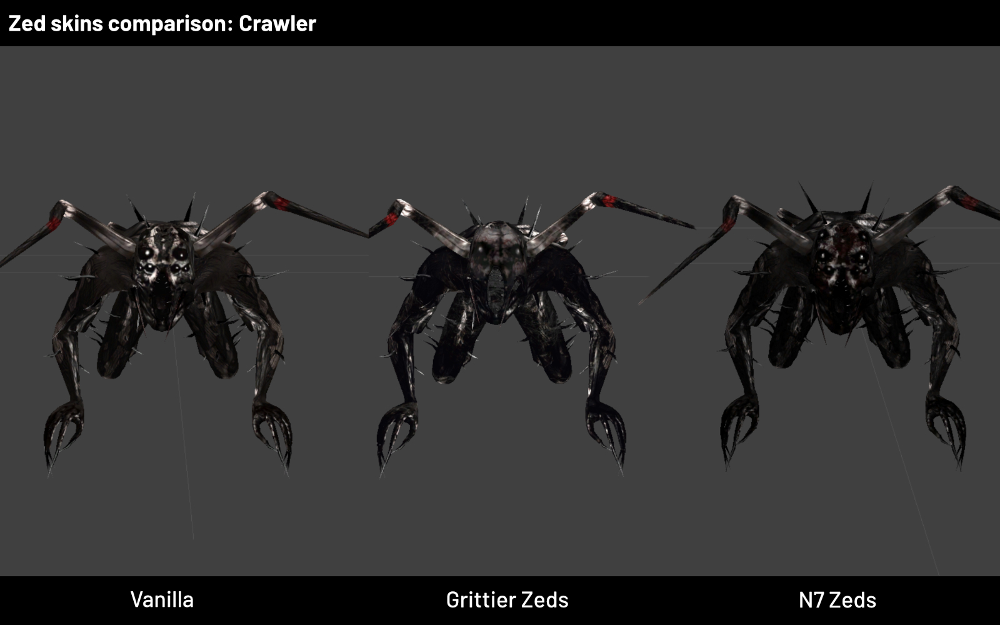
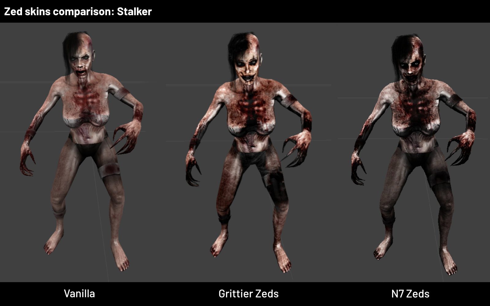
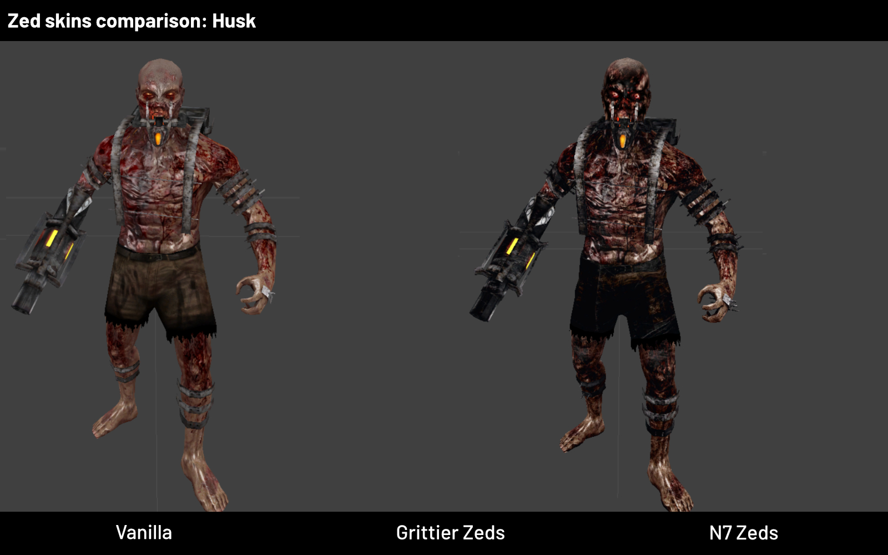
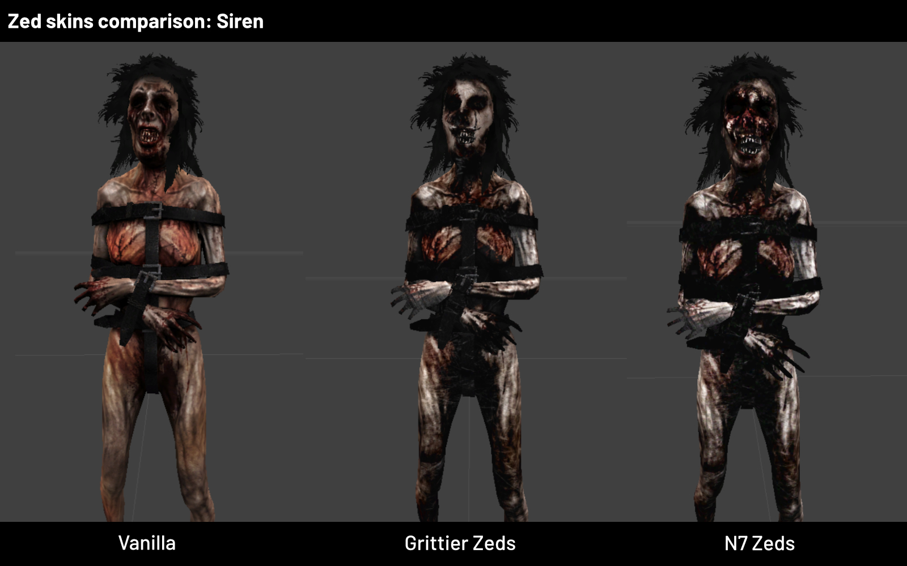
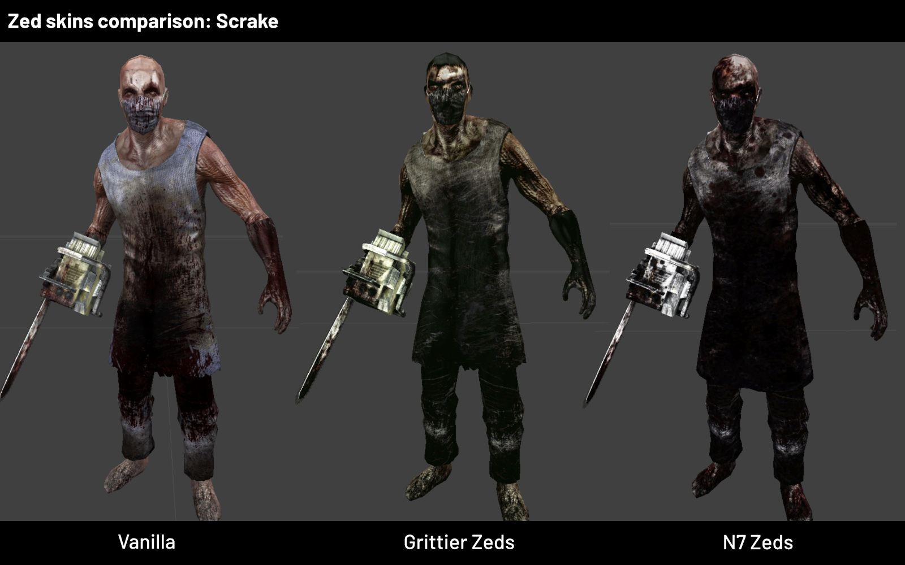
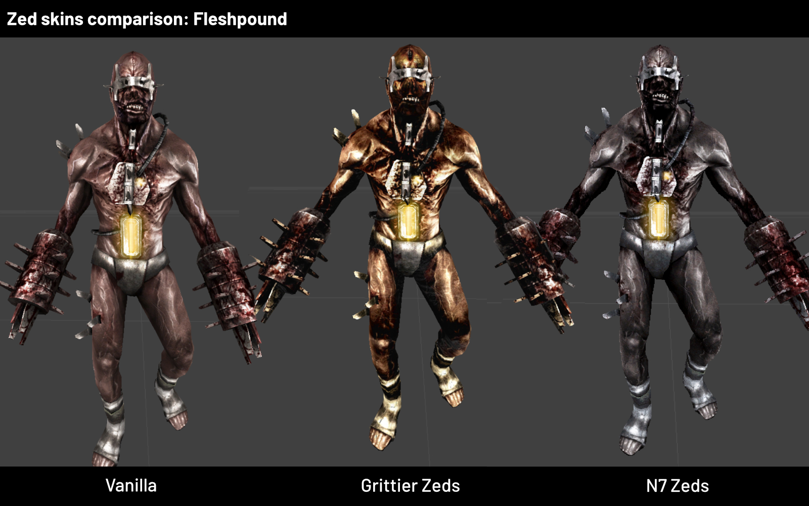
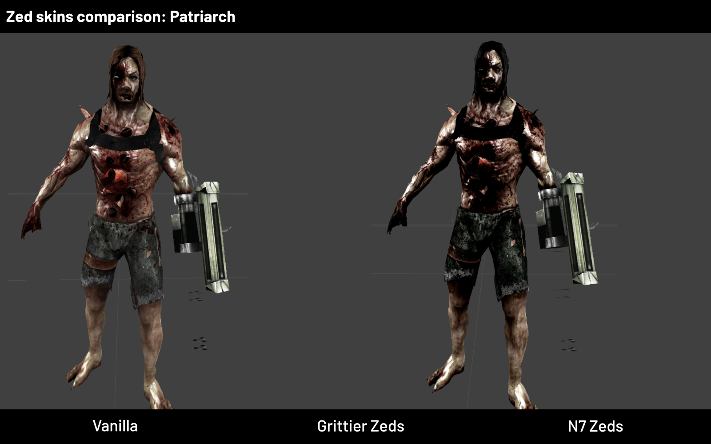
